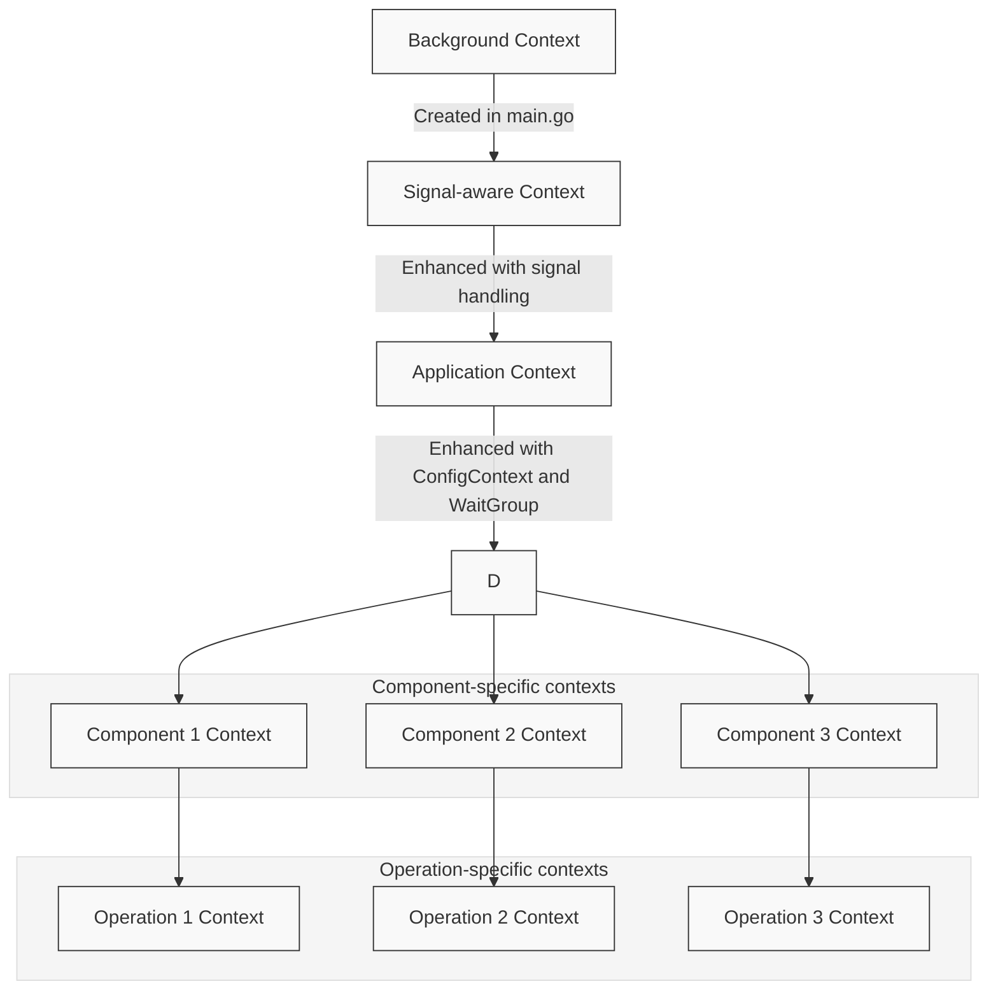

# Context Flow in Synapse Go

This document details how the Go context package is used throughout the Synapse Go application, focusing on the flow of context between components and how it enables coordination across the application lifecycle.

> **Note**: This document focuses on the architectural aspects of context flow in Synapse Go. For specific implementation details and code examples of context usage in various components, see [Context Usage in Components](../components/context-usage.md).

## Introduction to Context in Go

The `context` package in Go provides a way to carry request-scoped values, cancellation signals, and deadlines across API boundaries and between goroutines. It is a fundamental package for building robust, concurrent applications.

In Synapse Go, context serves several critical purposes:

1. **Dependency Injection**: Providing access to shared resources and configuration
2. **Cancellation Propagation**: Enabling clean shutdown across components
3. **Lifecycle Management**: Coordinating the startup and shutdown processes
4. **Request Scoping**: Managing request-specific data during message processing
5. **Timeout Management**: Preventing operations from blocking indefinitely

## Context Flow Architecture

The context in Synapse Go follows a hierarchical flow pattern, starting from the application entry point and cascading down to individual operations:



## Context Key Types

To ensure type safety when retrieving values from the context, Synapse Go defines strongly-typed context keys in `internal/pkg/core/utils/context_types.go`:

```go
type ContextKey string
type WGKey string

const ConfigContextKey ContextKey = "configContext"
const WaitGroupKey WGKey = "waitGroup"
```

These typed keys help prevent accidental key collisions and provide compile-time safety when accessing context values.

## Context Creation and Enhancement

### Root Context Creation

The entry point for the Synapse Go application is in `cmd/synapse/main.go`. Here, the root context is created with signal handling capabilities:

```go
func main() {
    ctx, stop := signal.NotifyContext(context.Background(), syscall.SIGINT, syscall.SIGTERM)
    defer stop()
    synapse.Run(ctx)
}
```

This context will be canceled when the process receives either a SIGINT (Ctrl+C) or SIGTERM signal, initiating the application's graceful shutdown process.

### Application Context Enhancement

In `internal/app/synapse/synapse.go`, the Run function enhances the context with application-wide resources:

```go
func Run(ctx context.Context) error {
    // Add WaitGroup to context for goroutine tracking
    var wg sync.WaitGroup
    ctx, cancel := context.WithCancel(ctx)
    ctx = context.WithValue(ctx, utils.WaitGroupKey, &wg)
    defer cancel()

    // Add ConfigContext to context for global access
    conCtx := artifacts.GetConfigContext()
    ctx = context.WithValue(ctx, utils.ConfigContextKey, conCtx)
    
    // Rest of initialization...
}
```

This enhancement process:

1. Adds cancellation capability to the context via `context.WithCancel()`
2. Stores a `sync.WaitGroup` for tracking goroutines
3. Stores the configuration context for global access

## Key Context Values and Their Usage

### WaitGroup

The WaitGroup stored in the context is used to track goroutines and ensure they all complete before the application exits. This is crucial for graceful shutdown:

```go
// When starting a new goroutine in any component
wg := ctx.Value(utils.WaitGroupKey).(*sync.WaitGroup)
wg.Add(1)
go func() {
    defer wg.Done()
    // Goroutine work...
}()

// In main shutdown sequence
<-ctx.Done()
wg.Wait() // Wait for all goroutines to complete
```

This pattern ensures that:

1. All goroutines are tracked in a centralized location
2. The application doesn't exit until all goroutines have completed their work
3. Resources are properly cleaned up during shutdown

### Configuration Context

The ConfigContext provides access to application configuration and artifact registries throughout the codebase:

```go
// Accessing configuration
configContext := ctx.Value(utils.ConfigContextKey).(*artifacts.ConfigContext)
serverConfig := configContext.DeploymentConfig["server"].(map[string]string)
hostname := serverConfig["hostname"]

// Accessing artifacts
sequence := configContext.SequenceMap[sequenceName]
```

This centralized configuration store:

1. Eliminates the need for global variables
2. Makes configuration accessible from any part of the codebase
3. Ensures all components work with the same configuration state

## Component-Specific Context Derivation

Components often derive their own context from the application context to add component-specific functionality:

### HTTP Server Context

```go
func (r *RouterService) StartServer(ctx context.Context) {
    wg := ctx.Value(utils.WaitGroupKey).(*sync.WaitGroup)
    wg.Add(1)
    
    go func() {
        defer wg.Done()
        
        // Listen for cancellation signal
        <-ctx.Done()
        
        // Create a timeout context for graceful shutdown
        shutdownCtx, cancel := context.WithTimeout(context.Background(), 10*time.Second)
        defer cancel()
        
        if err := r.server.Shutdown(shutdownCtx); err != nil {
            r.logger.Error("HTTP server shutdown error", "error", err)
        }
    }()
    
    // Start the server...
}
```

### File Inbound Context

```go
func (f *FileInbound) Start(ctx context.Context, mediator ports.InboundMessageMediator) error {
    // Create component-specific context with cancellation
    f.ctx, f.cancelFunc = context.WithCancel(ctx)
    f.wg = ctx.Value(utils.WaitGroupKey).(*sync.WaitGroup)
    
    // Start watching for file events...
}
```

## Operation-Specific Context Derivation

For individual operations that need timeouts or additional values, further context derivation occurs:

### Request Processing Context

```go
func (h *HTTPInbound) handleRequest(w http.ResponseWriter, r *http.Request, mediator ports.InboundMessageMediator) {
    // Use the request's context as base
    ctx := r.Context()
    
    // Add request information to the context
    requestID := uuid.New().String()
    ctx = context.WithValue(ctx, "requestID", requestID)
    
    // Further processing with the enhanced context
}
```

### File Processing Context

```go
func (f *FileInbound) processFile(filePath string, fileName string, mediator ports.InboundMessageMediator) {
    // Create a timeout context for file processing
    ctx, cancel := context.WithTimeout(f.ctx, 30*time.Second)
    defer cancel()
    
    // Add file information to context
    ctx = context.WithValue(ctx, "filename", fileName)
    ctx = context.WithValue(ctx, "filepath", filePath)
    
    // Process the file with the enhanced context
}
```

## Context Cancellation and Shutdown Flow

When a shutdown signal is received:

1. The root context is canceled via the signal handler in `main.go`
2. This cancellation propagates to all derived contexts throughout the application
3. Components listen for cancellation via `<-ctx.Done()`
4. Each component performs cleanup operations
5. The main function waits for all goroutines to complete with `wg.Wait()`

```go
// In synapse.go (main function)
<-ctx.Done()
wg.Wait()
routerService.StopServer()

// In HTTP server code
go func() {
    <-ctx.Done()
    // Shutdown server
}()

// In file inbound code
go func() {
    <-f.ctx.Done()
    f.logger.Info("File inbound shutting down")
    f.wg.Wait()
}()
```

This cancellation flow ensures that all components have a chance to clean up resources and that the application shuts down in an orderly fashion.

## Context in Message Mediation

The mediation system uses context to pass request-scoped information between mediators:

```go
func (m *LogMediator) Mediate(ctx context.Context, message *domain.Message) (*domain.Message, error) {
    // Extract request ID from context
    requestID, ok := ctx.Value("requestID").(string)
    
    // Log with context-provided information
    m.logger.Info("Processing message", 
        "requestID", requestID,
        "message", m.Message)
    
    return message, nil
}
```

This allows mediators to:

1. Access request-specific information
2. Observe and respect timeout limits
3. Add additional context values for downstream mediators

## Context Usage in Deployers

Deployers use context to access configuration and coordinate component startup:

```go
func (d *Deployer) DeployInbounds(ctx context.Context, fileName string, xmlData string) {
    // Access configuration
    configContext := ctx.Value(utils.ConfigContextKey).(*artifacts.ConfigContext)
    
    // Create and configure the inbound endpoint
    // ...
    
    // Register with configuration context
    configContext.AddInbound(newInbound)
    
    // Start the inbound endpoint with proper context and goroutine tracking
    wg := ctx.Value(utils.WaitGroupKey).(*sync.WaitGroup)
    wg.Add(1)
    go func(endpoint ports.InboundEndpoint) {
        defer wg.Done()
        if err := endpoint.Start(ctx, d.inboundMediator); err != nil {
            d.logger.Error("Error starting inbound endpoint:", "error", err)
        }
    }(inboundEndpoint)
}
```

## Best Practices Implemented

Synapse Go follows several best practices for context usage:

### 1. Type-Safe Context Keys

Using custom types for context keys prevents accidental collisions and provides type safety.

### 2. Context Propagation

The context flows through the entire call chain, ensuring cancellation signals reach all components.

### 3. Context Value Limitations

Context values are limited to request-scoped data that cannot be passed through function parameters.

### 4. Proper Timeout Handling

Timeouts are implemented for operations that should not block indefinitely, with proper cleanup via `defer cancel()`.

### 5. Consistent WaitGroup Management

The combination of context and WaitGroup ensures consistent tracking of goroutines.

### 6. Graceful Cancellation

Components respond to cancellation signals by cleaning up resources and shutting down cleanly.

## Advanced Context Patterns

### Context Chain of Responsibility

The mediation system uses a chain of responsibility pattern where each mediator receives the context, potentially enhances it, and passes it to the next mediator.

### Context Derivation Hierarchy

The context derivation hierarchy follows the component hierarchy, creating a tree of contexts that mirrors the application structure.

### Request-Scoped Storage

The context provides a safe way to store request-scoped data that flows through multiple components without polluting function signatures.

## Common Pitfalls Avoided

Synapse Go's context usage avoids common pitfalls:

1. **Storing Mutable State**: Context values are immutable and typically represent configuration or request identifiers.

2. **Context Pollution**: Only essential values are stored in the context, avoiding overflow with unnecessary data.

3. **Missing Cancellation Handlers**: All long-running operations check for context cancellation.

4. **Orphaned Goroutines**: The WaitGroup ensures all goroutines are properly tracked.

5. **Using Context for General Configuration**: Configuration is accessed through the context but is stored in a dedicated structure.

## Conclusion

The context usage in Synapse Go demonstrates a comprehensive approach to state management, concurrency control, and lifecycle coordination. By leveraging Go's context package effectively, the application achieves:

1. Clean dependency injection without global state
2. Coordinated shutdown across all components
3. Proper timeout handling for operations
4. Request-scoped data propagation
5. Resource cleanup and leak prevention

This approach enables Synapse Go to maintain a clean architecture while providing robust coordination between components during the entire application lifecycle.