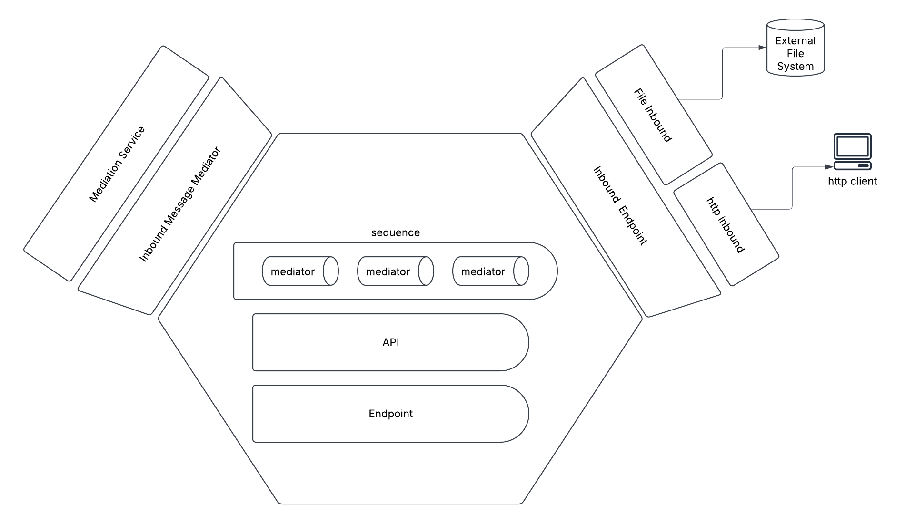

# Hexagonal Architecture in Synapse Go

## Understanding Hexagonal Architecture

Hexagonal Architecture (also known as Ports and Adapters pattern) is an architectural pattern that allows an application to be equally driven by users, programs, automated tests, or batch scripts, and to be developed and tested in isolation from its eventual runtime devices and databases.

The fundamental idea is to place the domain logic at the center (the hexagon) and define ways to interact with it through ports. Adapters are then connected to these ports to interact with the outside world.

### Key Concepts

**Domain**: The core business logic at the center of the application.

**Ports**: Interfaces that define how external components can interact with the domain (outward-facing) or how the domain interacts with external dependencies (inward-facing).

**Adapters**: Implementations that connect the domain to the external world through the ports.

## Hexagonal Architecture in Synapse Go

The Synapse Go codebase implements hexagonal architecture to provide a clean separation of concerns, making the system more maintainable, testable, and flexible. Here's how the architecture is organized:



### Folder Structure

The codebase follows a structured organization that directly maps to hexagonal architecture principles:

```
internal/
  app/
    adapters/          # Adapters (both primary and secondary)
      inbound/         # Primary adapters (HTTP, file inbound)
      mediation/       # Secondary adapters (mediation implementation)
    core/              # Domain core
      domain/          # Domain entities and business logic
      ports/           # Interfaces defining ports
      services/        # Core services implementing domain logic
  pkg/                 # Shared packages and utilities
    config/            # Configuration management
    core/              # Core components
      artifacts/       # Artifact definitions (APIs, Endpoints, etc.)
      deployers/       # Deployment mechanisms
      router/          # HTTP routing
```

### Domain Core

The domain core is located in the `internal/app/core` directory, which contains:

- **Domain Entities** (`domain/`): Core domain models and business logic
- **Ports** (`ports/`): Interfaces that define how the outside world communicates with the core
- **Services** (`services/`): Implementation of core domain services

#### Key Domain Interfaces (Ports)

```go
// InboundEndpoint represents an inbound endpoint (port)
type InboundEndpoint interface {
    Start(ctx context.Context, mediator InboundMessageMediator) error
    Stop() error
}

// InboundMessageMediator represents the mediation capability (port)
type InboundMessageMediator interface {
    Mediate(ctx context.Context, message *domain.Message) (*domain.Message, error)
}
```

These interfaces are defined in `internal/app/core/ports/ports.go` and form the boundary between the domain core and the adapters.

### Adapters

The adapters are located in the `internal/app/adapters` directory, which includes:

- **Primary Adapters** (Driving): Receive input from the outside world
  - HTTP Inbound: Handles incoming HTTP requests
  - File Inbound: Processes incoming files
  
- **Secondary Adapters** (Driven): Send output to external systems
  - Mediation: Implements mediation patterns for message processing

#### Primary Adapter Example: HTTP Inbound

```go
// http_inbound.go - An adapter that implements the InboundEndpoint port
type HTTPInbound struct {
    // implementation details
}

// Start implements InboundEndpoint interface
func (h *HTTPInbound) Start(ctx context.Context, mediator ports.InboundMessageMediator) error {
    // implementation details
}
```

#### Secondary Adapter Example: Mediation Engine

```go
// mediation.go - An adapter that implements the InboundMessageMediator port
type MediationEngine struct {
    // implementation details  
}

// Mediate implements InboundMessageMediator interface
func (m *MediationEngine) Mediate(ctx context.Context, message *domain.Message) (*domain.Message, error) {
    // implementation details
}
```

### Application Layer

The entry point and application orchestration logic is found in:

- `cmd/synapse/main.go`: Application entry point
- `internal/app/synapse/synapse.go`: Core application logic that coordinates components

This layer is responsible for:
- Initializing components
- Setting up adapters
- Connecting adapters to ports
- Managing the application lifecycle

## Benefits of Hexagonal Architecture in Synapse Go

1. **Separation of Concerns**: The domain logic is isolated from external concerns, making it easier to reason about.

2. **Testability**: The domain can be tested without external dependencies through port mocking.

3. **Flexibility**: Adapters can be swapped out without affecting the domain logic. For example, the file inbound adapter supports both FTP and SFTP through the same port interface.

4. **Maintainability**: Clean boundaries make the code easier to maintain as the system grows.

5. **Framework Independence**: The core domain doesn't depend on external frameworks, reducing vendor lock-in.

## Artifact Deployment Flow

An important aspect of Synapse Go's architecture is how it handles artifact deployment:

1. The deployer (in `internal/pkg/core/deployers`) reads artifact definitions (APIs, Endpoints, etc.) 
2. It creates domain representations of these artifacts
3. It registers these artifacts with the appropriate adapters
4. The adapters use these artifacts to drive behavior

This flow demonstrates how hexagonal architecture facilitates the dynamic configuration and behavior of the system through clean interfaces.

## Conclusion

The hexagonal architecture in Synapse Go provides a robust foundation for building an extensible, maintainable, and testable integration engine. By clearly defining interfaces between the domain core and the external world, the system achieves a high degree of modularity and flexibility.

The separation between the core business logic and external concerns allows for independent evolution of components and easier testing. It also makes it simpler to add new capabilities, such as additional inbound endpoints or mediation patterns, without modifying the existing code.