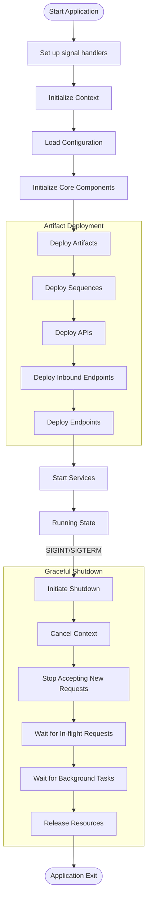

# Application Lifecycle

This document details the lifecycle of the Synapse Go application, from startup to graceful shutdown, with a focus on the deployment process.

## Application Entry Point

The entry point for the Synapse Go application is found in `cmd/synapse/main.go`. This file contains a minimal `main()` function that sets up signal handling and delegates to the main application function:

```go
func main() {
    ctx, stop := signal.NotifyContext(context.Background(), syscall.SIGINT, syscall.SIGTERM)
    defer stop()
    synapse.Run(ctx)
}
```

This code:

1. Creates a context that will be canceled when the process receives SIGINT (Ctrl+C) or SIGTERM signals
2. Sets up a deferred function to stop signal notification
3. Calls `synapse.Run()` with the context

## Lifecycle Flowchart

The following diagram illustrates the complete lifecycle of the Synapse Go application from startup to shutdown:



## Application Initialization

The core application logic is implemented in `internal/app/synapse/synapse.go` in the `Run()` function. This function coordinates the initialization and startup of all components.

### 1. Context Setup

The first step in the initialization process is setting up the application context:

```go
var wg sync.WaitGroup
ctx, cancel := context.WithCancel(ctx)
ctx = context.WithValue(ctx, utils.WaitGroupKey, &wg)
defer cancel()

// Adding config context to the GO context
conCtx := artifacts.GetConfigContext()
ctx = context.WithValue(ctx, utils.ConfigContextKey, conCtx)
```

This code:

- Creates a `WaitGroup` for tracking goroutines
- Enhances the context with cancellation capabilities
- Stores the `WaitGroup` in the context for global access
- Retrieves the configuration context singleton
- Stores the configuration context in the application context

### 2. Configuration Initialization

The next step is to resolve paths and initialize configuration:

```go
exePath, err := os.Executable()
if err != nil {
    log.Fatalf("Error getting executable path: %s", err.Error())
}

binDir := filepath.Dir(exePath)
confPath := filepath.Join(binDir, "..", "conf")

errConfig := config.InitializeConfig(ctx, confPath)
if errConfig != nil {
    log.Fatalf("Initialization error: %s", errConfig.Error())
}
```

This code:

- Determines the executable path
- Resolves the configuration directory path
- Initializes configuration from that path
- Updates the configuration context

### 3. Component Initialization

The core components are then initialized:

```go
mediationEngine := mediation.NewMediationEngine()

// Define default port
httpServerPort := 8290
var hostname string
if serverConfig, ok := conCtx.DeploymentConfig["server"].(map[string]string); ok {
    hostname = serverConfig["hostname"]
    if offsetStr, offsetExists := serverConfig["offset"]; offsetExists {
        if offsetInt, err := strconv.Atoi(offsetStr); err == nil {
            httpServerPort += offsetInt
            log.Printf("Using port offset: %d, final port: %d", offsetInt, httpServerPort)
        } else {
            log.Printf("Warning: Invalid offset value '%s', using default port", offsetStr)
        }
    }
}

// Convert the port to a string format expected by the HTTP server
listenPort := fmt.Sprintf(":%d", httpServerPort)

// Initialize the router service with the calculated port
routerService := router.NewRouterService(listenPort, hostname)
```

This code:

- Creates a new mediation engine (implements the `InboundMessageMediator` port)
- Retrieves server configuration from the configuration context
- Applies port offset if configured
- Creates the router service for handling HTTP requests

## Artifact Deployment Process

After initializing the core components, the application deploys the artifacts:

```go
artifactsPath := filepath.Join(binDir, "..", "artifacts")
deployer := deployers.NewDeployer(artifactsPath, mediationEngine, routerService)
err = deployer.Deploy(ctx)
if err != nil {
    log.Printf("Error deploying artifacts: %v", err)
}
```

This code:

- Resolves the path to the artifacts directory
- Creates a new deployer with references to the core components
- Deploys the artifacts

### Deployment Process Details

The deployment process, implemented in `internal/pkg/core/deployers/deployers.go`, handles various types of artifacts:

```go
func (d *Deployer) Deploy(ctx context.Context) error {
    files, err := os.ReadDir(d.basePath)
    if err != nil {
        return err
    }
    if len(files) == 0 {
        return nil
    }
    for _, artifactType := range []string{"Sequences", "APIs", "Inbounds","Endpoints"} {
        folderPath := filepath.Join(d.basePath, artifactType)
        files, err := os.ReadDir(folderPath)
        if err != nil {
            return err
        }
        for _, file := range files {
            if file.IsDir() || filepath.Ext(file.Name()) != ".xml" {
                continue
            }
            xmlFile, err := os.Open(filepath.Join(folderPath, file.Name()))
            if err != nil {
                return err
            }
            defer xmlFile.Close()
            data, err := io.ReadAll(xmlFile)
            if err != nil {
                d.logger.Error("Error reading file:", "error", err)
                continue
            }
            switch artifactType {
            case "APIs":
                d.DeployAPIs(ctx, file.Name(), string(data))
            case "Sequences":
                d.DeploySequences(ctx, file.Name(), string(data))
            case "Inbounds":
                d.DeployInbounds(ctx, file.Name(), string(data))
            case "Endpoints":
                d.DeployEndpoints(ctx, file.Name(), string(data))
            }
        }
    }
    return nil
}
```

This code:

1. Scans the artifacts directory for specific artifact types in a predefined order: Sequences, APIs, Inbounds, and Endpoints
2. Processes each XML file in these directories
3. Dispatches to the appropriate deployment method based on the artifact type

#### Artifact Type-Specific Deployment

Each artifact type has its own deployment method. For example, APIs are deployed using:

```go
func (d *Deployer) DeployAPIs(ctx context.Context, fileName string, xmlData string) {
    position := artifacts.Position{FileName: fileName}
    api := types.API{}
    newApi, err := api.Unmarshal(xmlData, position)
    if err != nil {
        d.logger.Error("Error unmarshalling api:", "error", err)
        return
    }
    configContext := ctx.Value(utils.ConfigContextKey).(*artifacts.ConfigContext)
    configContext.AddAPI(newApi)

    d.logger.Info("Deployed API: " + newApi.Name)

    // Register the API with the router service
    if err := d.routerService.RegisterAPI(ctx, newApi); err != nil {
        d.logger.Error("Error registering API with router service:", "error", err)
        return
    }
}
```

This pattern is repeated for each artifact type, with the general flow being:

1. Create a position marker for error reporting
2. Unmarshal the XML data into the appropriate domain model
3. Add the artifact to the configuration context
4. Register the artifact with the appropriate service

### Inbound Endpoints Deployment

Inbound endpoints require special handling because they spawn background processes:

```go
func (d *Deployer) DeployInbounds(ctx context.Context, fileName string, xmlData string) {
    position := artifacts.Position{FileName: fileName}
    inboundEp := types.Inbound{}
    newInbound, err := inboundEp.Unmarshal(xmlData, position)
    if err != nil {
        d.logger.Error("Error unmarshalling inbound:", "error", err)
        return
    }
    configContext := ctx.Value(utils.ConfigContextKey).(*artifacts.ConfigContext)
    configContext.AddInbound(newInbound)
    d.logger.Info("Deployed inbound: " + newInbound.Name)

    // Start the inbound endpoint
    parametersMap := make(map[string]string)
    for _, param := range newInbound.Parameters {
        parametersMap[param.Name] = param.Value
    }
    inboundEndpoint, err := inbound.NewInbound(domain.InboundConfig{
        SequenceName: newInbound.Sequence,
        Name:         newInbound.Name,
        Protocol:     newInbound.Protocol,
        Parameters:   parametersMap,
    })
    if err != nil {
        d.logger.Error("Error creating inbound endpoint:", "error", err)
        return
    }

    wg := ctx.Value(utils.WaitGroupKey).(*sync.WaitGroup)
    wg.Add(1)
    go func(endpoint ports.InboundEndpoint) {
        defer wg.Done()
        if err := endpoint.Start(ctx, d.inboundMediator); err != nil {
            d.logger.Error("Error starting inbound endpoint:", "error", err)
        }
    }(inboundEndpoint)
}
```

This code follows the same pattern but adds:

1. Parameter mapping for configuration
2. Dynamic creation of the inbound endpoint using a factory
3. Spawning a goroutine to run the inbound endpoint
4. Using the wait group to track the goroutine for graceful shutdown

## Service Startup

After deploying artifacts, the application starts the HTTP server:

```go
// Start HTTP Server
routerService.StartServer(ctx)

elapsed := time.Since(start)
log.Printf("Server started in: %v", elapsed)
```

## Graceful Shutdown

A key feature of Synapse Go is its graceful shutdown mechanism:

```go
<-ctx.Done()
wg.Wait()
routerService.StopServer()
log.Println("HTTP server shutdown gracefully")
```

This code:

1. Blocks until the context is canceled (e.g., due to a signal)
2. Waits for all tracked goroutines to complete
3. Shuts down the router service (HTTP server)
4. Logs the completion of the shutdown process

### Shutdown Sequence

The graceful shutdown process ensures that:

1. No new requests are accepted once a shutdown signal is received
2. In-flight requests are allowed to complete
3. Background processes (like inbound endpoints) have a chance to clean up
4. Resources are released in an orderly manner

#### Wait Group Usage

The wait group plays a critical role in coordinating the graceful shutdown:

- Each background goroutine increments the wait group counter when it starts
- Each goroutine decrements the counter when it finishes
- The main goroutine waits for all counters to reach zero before continuing shutdown

This ensures that all background tasks have a chance to complete any work and release resources before the application exits.

## Example Flow: HTTP Inbound Endpoint

To illustrate the complete lifecycle, consider an HTTP inbound endpoint:

1. **Deployment**: The inbound endpoint is defined in an XML file and deployed by the deployer
2. **Initialization**: The endpoint is created and a goroutine is spawned to run it
3. **Operation**: The endpoint handles incoming HTTP requests during normal operation
4. **Shutdown**: When a shutdown signal is received:
   - The context is canceled, signaling to the endpoint that it should stop
   - The endpoint completes any in-flight requests
   - The endpoint's goroutine exits, decrementing the wait group
   - The wait group counter eventually reaches zero
   - The main goroutine continues with router service shutdown

## Summary

The Synapse Go application lifecycle follows a clean and structured process:

1. **Initialization**: Set up context, configuration, and core components
2. **Deployment**: Load and register artifacts from filesystem
3. **Startup**: Start services and background processes
4. **Operation**: Process requests and perform integration tasks
5. **Shutdown**: Gracefully stop all services when a shutdown signal is received

This lifecycle ensures that:

- The application starts up in a predictable manner
- Components are initialized in the correct order
- Background processes are properly tracked
- Resources are released gracefully during shutdown

The use of a wait group and context cancellation provides a robust mechanism for coordinating shutdown across multiple goroutines, which is essential for a multi-threaded application like Synapse Go.