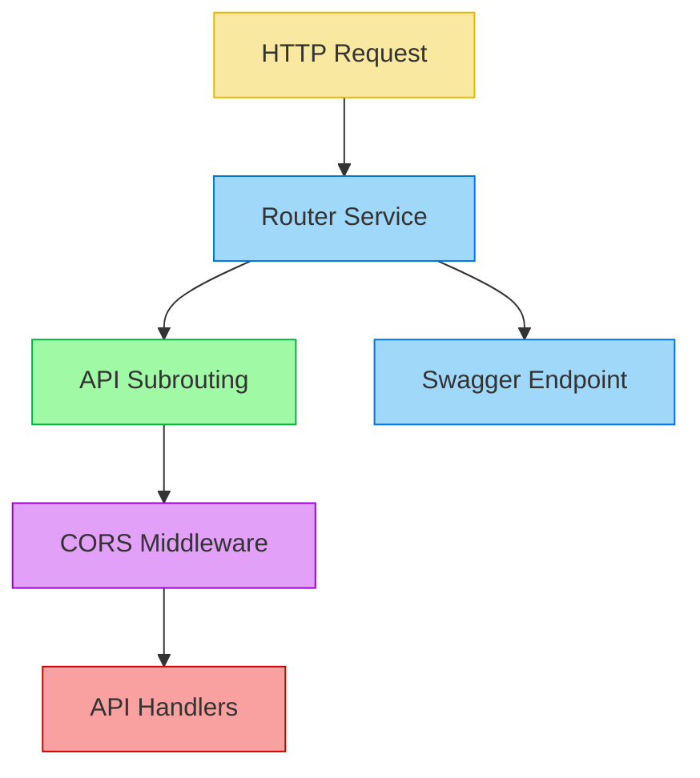

# API & CORS Implementation

This document details the implementation of REST API handling in Synapse Go, including the router service, API versioning, path and query parameter handling, CORS support, and Swagger documentation generation.

## Router Service Architecture

The core of API handling in Synapse Go is the router service, which is responsible for accepting HTTP requests, routing them to the appropriate handlers, and returning responses.



## Router Service Implementation

The router service is implemented in `internal/pkg/core/router/service.go` and is responsible for:
- Creating and managing the HTTP server
- Registering APIs and their routes
- Applying CORS middleware
- Exposing Swagger documentation

```go
type RouterService struct {
    server        *http.Server
    router        *mux.Router
    hostname      string
    listenAddress string
    logger        *slog.Logger
    level         slog.Level
    apis          map[string]artifacts.API
}
```

### Initialization

The router service is initialized with a listen address (port) and hostname:

```go
func NewRouterService(listenAddr string, hostname string) *RouterService {
    router := mux.NewRouter().StrictSlash(true)
    
    server := &http.Server{
        Addr:    listenAddr,
        Handler: router,
    }
    
    return &RouterService{
        server:        server,
        router:        router,
        hostname:      hostname,
        listenAddress: listenAddr,
        logger:        loggerfactory.GetLogger("router"),
        apis:          make(map[string]artifacts.API),
    }
}
```

### Starting the Server

The server is started in a goroutine to avoid blocking:

```go
func (r *RouterService) StartServer(ctx context.Context) {
    wg := ctx.Value(utils.WaitGroupKey).(*sync.WaitGroup)
    wg.Add(1)
    
    go func() {
        defer wg.Done()
        
        r.logger.Info("Starting HTTP server", "address", r.server.Addr)
        if err := r.server.ListenAndServe(); err != nil && err != http.ErrServerClosed {
            r.logger.Error("HTTP server error", "error", err)
        }
    }()
    
    go func() {
        <-ctx.Done()
        r.logger.Info("Shutting down HTTP server...")
        
        // Create a timeout context for graceful shutdown
        shutdownCtx, cancel := context.WithTimeout(context.Background(), 10*time.Second)
        defer cancel()
        
        if err := r.server.Shutdown(shutdownCtx); err != nil {
            r.logger.Error("HTTP server shutdown error", "error", err)
        }
    }()
}
```

This implementation:
1. Adds a counter to the wait group to track the server goroutine
2. Starts the server in a goroutine
3. Creates a second goroutine that waits for context cancellation
4. Uses a timeout context for graceful shutdown
5. Decrements the wait group counter when the server exits

### Graceful Shutdown

The router service implements graceful shutdown with a configurable timeout:

```go
func (r *RouterService) StopServer() {
    r.logger.Info("HTTP server shutdown complete")
}
```

This method is called by the main application after waiting for all goroutines to complete.

## API Registration and Routing

When an API is deployed, it is registered with the router service:

```go
func (r *RouterService) RegisterAPI(ctx context.Context, api artifacts.API) error {
    r.apis[api.Name] = api
    
    // Calculate base path
    basePath := api.calculateBasePath()
    
    // Create a subrouter for this API
    apiRouter := r.router.PathPrefix(basePath).Subrouter()
    
    // Register Swagger endpoints
    r.registerSwaggerEndpoints(apiRouter, api)
    
    // Register API resources with CORS if enabled
    for _, resource := range api.Resources {
        r.registerResource(apiRouter, resource, api.CORSConfig)
    }
    
    r.logger.Info("Registered API", "name", api.Name, "basePath", basePath)
    return nil
}
```

This method:
1. Stores the API in the router service's map
2. Calculates the base path for the API
3. Creates a subrouter for the API
4. Registers Swagger documentation endpoints
5. Registers each resource with CORS middleware if enabled

## API Versioning

Synapse Go supports API versioning through two mechanisms:

1. **Context-Based Versioning**: The version is part of the URL path
2. **URL Parameter Versioning**: The version is a query parameter

```go
func (api *API) calculateBasePath() string {
    basePath := api.Context
    
    // Add version to path if specified
    if api.Version != "" {
        if api.VersionType == "context" {
            // Replace {version} placeholder with actual version
            basePath = strings.Replace(basePath, "{version}", api.Version, -1)
        }
    }
    
    return basePath
}
```

For example, with context-based versioning:
- API context: `/healthcare/{version}/services`
- API version: `1.0`
- Final path: `/healthcare/1.0/services`

## Path and Query Parameters

The URI template in each resource is parsed to extract path parameters and query parameters:

```go
func (r *Resource) parseURITemplate(uriTemplate string) (artifacts.URITemplateInfo, error) {
    info := artifacts.URITemplateInfo{
        FullTemplate:   uriTemplate,
        PathTemplate:   "",
        PathParameters: []string{},
        QueryParams:    map[string]string{},
    }
    
    // Split on the question mark to separate path from query parameters
    parts := strings.SplitN(uriTemplate, "?", 2)
    info.PathTemplate = parts[0]
    
    // Extract path parameters
    pathRegex := regexp.MustCompile(`\{([^/]+?)\}`)
    matches := pathRegex.FindAllStringSubmatch(info.PathTemplate, -1)
    for _, match := range matches {
        if len(match) > 1 {
            info.PathParameters = append(info.PathParameters, match[1])
        }
    }
    
    // Extract query parameters if they exist
    if len(parts) > 1 {
        queryPart := parts[1]
        queryParams := strings.Split(queryPart, "&amp;")
        for _, param := range queryParams {
            paramParts := strings.SplitN(param, "=", 2)
            if len(paramParts) > 1 {
                paramName := paramParts[0]
                paramValue := paramParts[1]
                
                // Extract parameter name from {name} format
                paramRegex := regexp.MustCompile(`\{([^{}]+)\}`)
                paramMatch := paramRegex.FindStringSubmatch(paramValue)
                if len(paramMatch) > 1 {
                    info.QueryParams[paramName] = paramMatch[1]
                }
            }
        }
    }
    
    return info, nil
}
```

This parsing enables:
1. Proper route registration with gorilla/mux
2. Documentation generation for Swagger
3. Runtime access to parameter values

## Resource Registration

Each API resource is registered with the router:

```go
func (r *RouterService) registerResource(router *mux.Router, resource artifacts.Resource, corsConfig artifacts.CORSConfig) {
    // Create route with path parameters
    route := router.Path(resource.URITemplate.PathTemplate)
    
    // Restrict to specified HTTP methods
    route = route.Methods(resource.Methods...)
    
    // Create handler
    handler := http.HandlerFunc(func(w http.ResponseWriter, req *http.Request) {
        r.handleRequest(w, req, resource)
    })
    
    // Apply CORS middleware if enabled
    if corsConfig.Enabled {
        handler = cors.CORSMiddleware(handler, corsConfig)
    }
    
    // Register the handler
    route.Handler(handler)
}
```

This registration process:
1. Creates a route with the appropriate path template
2. Restricts the route to the specified HTTP methods
3. Creates a handler function
4. Applies CORS middleware if enabled
5. Registers the handler with the route

## CORS Support

Synapse Go provides comprehensive CORS (Cross-Origin Resource Sharing) support through middleware:

```go
func CORSMiddleware(handler http.Handler, config artifacts.CORSConfig) http.Handler {
    // Skip CORS handling if disabled
    if !config.Enabled {
        return handler
    }
    
    // Convert our config to rs/cors options
    options := cors.Options{
        AllowedOrigins:   config.AllowOrigins,
        AllowedMethods:   config.AllowMethods,
        AllowedHeaders:   config.AllowHeaders,
        ExposedHeaders:   config.ExposeHeaders,
        AllowCredentials: config.AllowCredentials,
        MaxAge:           config.MaxAge,
    }
    
    // Create the cors handler
    corsHandler := cors.New(options)
    
    // Use the handler as middleware
    return corsHandler.Handler(handler)
}
```

This middleware:
1. Checks if CORS is enabled
2. Converts the Synapse configuration to rs/cors options
3. Creates a CORS handler
4. Applies the handler as middleware

### CORS Configuration

CORS is configured in the API definition:

```xml
<api name="HealthcareAPI" context="/healthcare/{version}/services" version="1.0" version-type="context">
    <cors enabled="true"
        allow-origins="https://example.com,https://app.example.com"
        allow-methods="GET,POST,PUT,DELETE,PATCH,OPTIONS"
        allow-headers="Content-Type,Authorization,X-Requested-With,Accept"
        expose-headers="X-Request-ID,X-Response-Time"
        allow-credentials="true"
        max-age="3600" />
    <!-- Resources -->
</api>
```

This configuration is parsed during artifact deployment:

```go
func (api *API) Unmarshal(xmlData string, position artifacts.Position) (artifacts.API, error) {
    // ...
    case "cors":
        // Parse CORS element
        corsElem := &CORSElement{}
        if err := decoder.DecodeElement(corsElem, &elem); err != nil {
            return artifacts.API{}, fmt.Errorf("error decoding CORS element: %w", err)
        }
        
        // Parse the CORS configuration
        cors := artifacts.DefaultCORSConfig()
        
        // Enable CORS if specified
        if corsElem.Enabled == "true" {
            cors.Enabled = true
        }
        
        // Parse allowed origins
        if corsElem.AllowOrigins != "" {
            cors.AllowOrigins = strings.Split(corsElem.AllowOrigins, ",")
            for i := range cors.AllowOrigins {
                cors.AllowOrigins[i] = strings.TrimSpace(cors.AllowOrigins[i])
            }
        }
        
        // Parse other CORS settings
        // ...
        
        newAPI.CORSConfig = cors
    // ...
}
```

## Swagger Documentation

Synapse Go automatically generates Swagger/OpenAPI documentation for each API:

```go
func (r *RouterService) registerSwaggerEndpoints(router *mux.Router, api artifacts.API) {
    // Register JSON endpoint
    router.Path("/swagger.json").Methods("GET").HandlerFunc(func(w http.ResponseWriter, req *http.Request) {
        if err := api.ServeSwaggerJSON(w, r.hostname, r.listenAddress); err != nil {
            http.Error(w, "Error generating Swagger JSON", http.StatusInternalServerError)
        }
    })
    
    // Register YAML endpoint
    router.Path("/swagger.yaml").Methods("GET").HandlerFunc(func(w http.ResponseWriter, req *http.Request) {
        if err := api.ServeSwaggerYAML(w, r.hostname, r.listenAddress); err != nil {
            http.Error(w, "Error generating Swagger YAML", http.StatusInternalServerError)
        }
    })
}
```

### OpenAPI Specification Generation

The OpenAPI specification is generated dynamically based on the API definition:

```go
func (api *API) GenerateOpenAPISpec(hostname string, port string) (map[string]interface{}, error) {
    // --- 1. Basic OpenAPI Structure ---
    spec := make(map[string]interface{})
    spec["openapi"] = "3.0.3" // Specify OpenAPI version
    
    // --- 2. Info Object ---
    info := make(map[string]interface{})
    title := api.Name
    if title == "" {
        title = "API Documentation"
    }
    info["title"] = title
    info["version"] = api.Version
    spec["info"] = info
    
    // --- 3. Servers Object ---
    basePath := api.calculateBasePath()
    serverURL := fmt.Sprintf("http://%s%s%s", hostname, port, basePath)
    servers := []map[string]interface{}{
        {
            "url": serverURL,
        },
    }
    spec["servers"] = servers
    
    // --- 4. Paths Object ---
    paths := make(map[string]interface{})
    
    for _, resource := range api.Resources {
        // Generate path item for each resource
        // ...
    }
    
    spec["paths"] = paths
    
    return spec, nil
}
```

This process:
1. Creates the basic OpenAPI structure
2. Adds API information
3. Generates server information
4. Builds path objects from API resources
5. Includes parameters, request bodies, and responses

## Request Handling Flow

When a request is received, it flows through the following components:

1. **HTTP Server**: Accepts the connection
2. **Router**: Routes to the appropriate handler based on path and method
3. **CORS Middleware**: Applies CORS headers if enabled
4. **Handler Function**: Processes the request
5. **Mediation Engine**: Executes the mediation sequence
6. **Response**: Returns the result

```go
func (r *RouterService) handleRequest(w http.ResponseWriter, req *http.Request, resource artifacts.Resource) {
    // Create context for this request
    ctx := req.Context()
    
    // Execute inbound sequence if defined
    if resource.InSequence.MediatorList != nil && len(resource.InSequence.MediatorList) > 0 {
        // Create message from request
        message := &domain.Message{
            Payload: req,
        }
        
        // Get the mediation engine
        mediator := ctx.Value(utils.MediationEngineKey).(ports.InboundMessageMediator)
        
        // Execute the sequence
        result, err := resource.InSequence.Mediate(ctx, message, mediator)
        if err != nil {
            // Handle error
            // ...
            return
        }
        
        // Process result
        // ...
    }
}
```

## Summary

The API implementation in Synapse Go provides:

1. **Flexible Routing**: Routing based on path, method, and parameters
2. **API Versioning**: Support for context and URL-based versioning
3. **CORS Support**: Comprehensive CORS configuration via middleware
4. **Swagger Integration**: Automatic generation of OpenAPI specifications
5. **Graceful Shutdown**: Clean HTTP server shutdown
6. **Mediation Integration**: Seamless integration with the mediation engine

This implementation aligns with the hexagonal architecture principles by:
- Using a clean interface between the router service and other components
- Isolating HTTP handling in a specific adapter
- Delegating domain logic to the appropriate core components
- Providing a consistent API for artifact deployment and registration