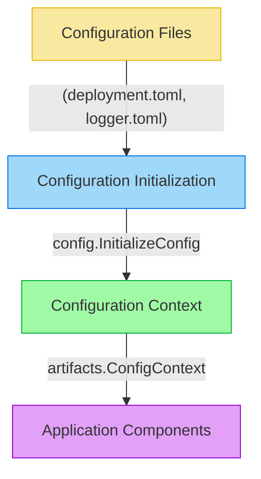

# Configuration Management

This document explains the configuration management system in Synapse Go, including how configuration is loaded, stored, and accessed throughout the application.

## Configuration Architecture

Synapse Go uses a centralized configuration system built around the `ConfigContext` struct, which serves as a container for all configuration data. The configuration management is implemented in the `internal/pkg/config` package and used throughout the application.



## Configuration Context

The central component of the configuration system is the `ConfigContext` struct, defined in `internal/pkg/core/artifacts/artifact.go`:

```go
type ConfigContext struct {
    ApiMap           map[string]API
    EndpointMap      map[string]Endpoint
    SequenceMap      map[string]Sequence
    InboundMap       map[string]Inbound
    DeploymentConfig map[string]interface{}
}
```

This struct:
- Stores all artifacts (APIs, Endpoints, Sequences, Inbounds)
- Contains the deployment configuration
- Is accessed throughout the application via the Go context

### Singleton Pattern

The `ConfigContext` is implemented as a singleton to ensure that there's a single consistent source of configuration throughout the application:

```go
var instance *ConfigContext
var once sync.Once

// singleton instance of the ConfigContext
func GetConfigContext() *ConfigContext {
    once.Do(func() {
        instance = &ConfigContext{
            ApiMap:           make(map[string]API),
            EndpointMap:      make(map[string]Endpoint),
            SequenceMap:      make(map[string]Sequence),
            InboundMap:       make(map[string]Inbound),
            DeploymentConfig: make(map[string]interface{}),
        }
    })
    return instance
}
```

This ensures that regardless of where or how many times the function is called, the same instance is returned.

## Configuration Initialization

Configuration is initialized in `internal/pkg/config/config.go`:

```go
func InitializeConfig(ctx context.Context, confFolderPath string) error {
    // Get the configuration files from the confFolderPath
    configFiles, err := os.ReadDir(confFolderPath)
    // ...

    // Process each configuration file
    for _, configFile := range configFiles {
        // ...
        configFilePath := filepath.Join(confFolderPath, configFile.Name())
        cfg := koanf.New(".")

        // Load configuration using Koanf library
        if err := cfg.Load(file.Provider(configFilePath), toml.Parser()); err != nil {
            return err
        }

        // Process configuration based on file name
        switch {
        case strings.Contains(configFile.Name(), "Logger"):
            // Process logger configuration
            // ...
        case strings.Contains(configFile.Name(), "deployment"):
            // Process deployment configuration
            deploymentConfigMap := make(map[string]interface{})
            if cfg.IsSet("server") {
                var serverConfigMap map[string]string
                cfg.MustUnmarshal("server", &serverConfigMap)
                // Validate configuration
                // ...
                deploymentConfigMap["server"] = serverConfigMap
            }
            configContext.AddDeploymentConfig(deploymentConfigMap)
        }
    }
    return nil
}
```

The initialization process:
1. Scans the configuration directory for TOML files
2. Uses the Koanf library to load and parse the configuration files
3. Processes specific configuration files (logger, deployment)
4. Validates required configuration values
5. Updates the `ConfigContext` with the loaded configuration

## Accessing Configuration

Configuration is accessed by retrieving the `ConfigContext` from the Go context:

```go
// Example of accessing configuration from context
configContext := ctx.Value(utils.ConfigContextKey).(*artifacts.ConfigContext)
```

The `ConfigContext` provides methods for accessing specific types of configuration:

```go
// Get an endpoint configuration
endpoint := configContext.GetEndpoint("endpointName")

// Access server configuration
serverConfig, ok := configContext.DeploymentConfig["server"].(map[string]string)
if ok {
    hostname := serverConfig["hostname"]
    // ...
}
```

## Configuration Validation

The configuration system includes validation to ensure that required configuration values are present and valid:

```go
// Validate required hostname key
hostname, exists := serverConfigMap["hostname"]
if !exists {
    return fmt.Errorf("missing required server configuration key: hostname")
}

// Validate hostname value
if hostname == "" {
    return fmt.Errorf("server hostname cannot be empty")
}

// Validate offset if it exists (optional)
if offsetStr, hasOffset := serverConfigMap["offset"]; hasOffset && offsetStr != "" {
    offset, err := strconv.Atoi(offsetStr)
    if err != nil {
        return fmt.Errorf("invalid server offset value: %s, must be an integer", offsetStr)
    }
    if offset < 0 {
        return fmt.Errorf("server offset must be non-negative, got: %d", offset)
    }
}
```

This validation ensures that the application has all the configuration values it needs and that they are in the expected format.

## Configuration Structure

The configuration files are structured as TOML files, which provide a clear and readable format for configuration.

### deployment.toml

```toml
[server]
hostname = "localhost"
offset = "0"
```

This file contains server-level configuration, such as the hostname and port offset.

### LoggerConfig.toml

```toml
[levels]
default = "INFO"
deployers = "INFO"
router = "INFO"
mediation = "INFO"
```

This file configures the logging levels for different components of the application.

## Dynamic Configuration

The configuration system is designed to support dynamic configuration changes, particularly for logging levels. This is implemented through a file watcher mechanism:

```go
// Start watching for config changes
cfg.Watch(context.Background(), configFilePath)
```

When a configuration file changes, the application automatically reloads the configuration without requiring a restart.

## Summary

The Synapse Go configuration system:

- Provides a centralized, singleton configuration context
- Loads configuration from TOML files
- Validates configuration values
- Makes configuration accessible throughout the application via the Go context
- Supports dynamic configuration changes
- Stores both static configuration and runtime artifacts

This design ensures that configuration is consistent, accessible, and manageable throughout the application lifecycle.