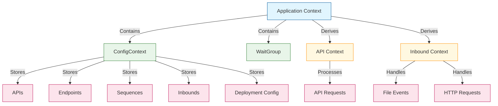

# Context Usage in Synapse Go

This document details how the Go context package is utilized throughout the Synapse Go application for dependency injection, cancellation signaling, and value propagation.

> **Note**: This document focuses on specific implementation details and code examples of context usage in various components. For a higher-level architectural overview of how context flows through the application, see [Context Flow in Architecture](../architecture/context-flow.md).

## Overview

The context package in Go is a powerful tool for carrying request-scoped values, cancellation signals, and deadlines across API boundaries and between processes. Synapse Go makes extensive use of contexts for multiple purposes:



## Context Key Definitions

Synapse Go defines context keys in `internal/pkg/core/utils/context_types.go`:

```go
type ContextKey string
type WGKey string

const ConfigContextKey ContextKey = "configContext"
const WaitGroupKey WGKey = "waitGroup"
```

These typed keys ensure type safety when accessing values stored in the context.

## Main Application Context

The main context is created at the application entry point in `cmd/synapse/main.go`:

```go
func main() {
    ctx, stop := signal.NotifyContext(context.Background(), syscall.SIGINT, syscall.SIGTERM)
    defer stop()
    synapse.Run(ctx)
}
```

This context is:
1. Derived from the background context
2. Enhanced with signal notification for SIGINT and SIGTERM
3. Passed to the main Run function

## Context Enhancement

In `internal/app/synapse/synapse.go`, the context is enhanced with application-wide values:

```go
func Run(ctx context.Context) error {
    // Add WaitGroup to context
    var wg sync.WaitGroup
    ctx, cancel := context.WithCancel(ctx)
    ctx = context.WithValue(ctx, utils.WaitGroupKey, &wg)
    defer cancel()

    // Add ConfigContext to context
    conCtx := artifacts.GetConfigContext()
    ctx = context.WithValue(ctx, utils.ConfigContextKey, conCtx)
    
    // ...rest of initialization code...
}
```

This enhancement:
1. Adds cancellation capability to the context
2. Stores a WaitGroup for goroutine tracking
3. Stores the configuration context for global access

## Configuration Context Usage

The configuration context is accessed throughout the application to retrieve configuration values and artifacts:

```go
// Example from deployer
func (d *Deployer) DeployAPIs(ctx context.Context, fileName string, xmlData string) {
    // ...
    configContext := ctx.Value(utils.ConfigContextKey).(*artifacts.ConfigContext)
    configContext.AddAPI(newApi)
    // ...
}

// Example from HTTP inbound
func (h *HTTPInbound) handleRequest(w http.ResponseWriter, r *http.Request, mediator ports.InboundMessageMediator) {
    // ...
    ctx := r.Context()
    configContext := ctx.Value(utils.ConfigContextKey).(*artifacts.ConfigContext)
    sequence := configContext.SequenceMap[h.config.SequenceName]
    // ...
}
```

## WaitGroup Usage

The WaitGroup stored in the context is used to track goroutines and ensure graceful shutdown:

```go
// Example from router service
func (r *RouterService) StartServer(ctx context.Context) {
    wg := ctx.Value(utils.WaitGroupKey).(*sync.WaitGroup)
    wg.Add(1)
    
    go func() {
        defer wg.Done()
        // Server code
    }()
    
    // ...
}

// Example from inbound deployer
func (d *Deployer) DeployInbounds(ctx context.Context, fileName string, xmlData string) {
    // ...
    wg := ctx.Value(utils.WaitGroupKey).(*sync.WaitGroup)
    wg.Add(1)
    go func(endpoint ports.InboundEndpoint) {
        defer wg.Done()
        // Inbound endpoint code
    }(inboundEndpoint)
}
```

## Context Cancellation Propagation

Context cancellation is used to signal shutdown to all components:

```go
// In synapse.go (main function)
<-ctx.Done()
wg.Wait()
routerService.StopServer()

// In HTTP server code
go func() {
    <-ctx.Done()
    // Shutdown server
}()

// In file inbound code
go func() {
    <-f.ctx.Done()
    f.logger.Info("File inbound shutting down")
    f.wg.Wait()
}()
```

This pattern ensures that:
1. All components receive the shutdown signal simultaneously
2. Each component has a chance to perform cleanup operations
3. The main function waits until all goroutines have completed

## Context Timeout Management

For operations that should not block indefinitely, timeout contexts are used:

```go
// In router service for HTTP server shutdown
shutdownCtx, cancel := context.WithTimeout(context.Background(), 10*time.Second)
defer cancel()

if err := r.server.Shutdown(shutdownCtx); err != nil {
    r.logger.Error("HTTP server shutdown error", "error", err)
}

// In file processing for limiting operation time
ctx, cancel := context.WithTimeout(f.ctx, 30*time.Second)
defer cancel()

// Process file with timeout
result, err := mediator.Mediate(ctx, message)
```

## Context in Request Handling

For HTTP requests, the request context is used to carry request-specific information:

```go
func (h *HTTPInbound) handleRequest(w http.ResponseWriter, r *http.Request, mediator ports.InboundMessageMediator) {
    // Use the request's context
    ctx := r.Context()
    
    // Add request information to the context if needed
    ctx = context.WithValue(ctx, "requestID", uuid.New().String())
    
    // Use the enhanced context for mediation
    result, err := sequence.Mediate(ctx, message, mediator)
    // ...
}
```

## Context Values for Mediators

Mediators can access and add values to the context during message processing:

```go
func (m *LogMediator) Mediate(ctx context.Context, message *domain.Message) (*domain.Message, error) {
    // Get information from context
    requestID := ctx.Value("requestID")
    
    // Log with context information
    m.logger.Info("Processing message", 
        "requestID", requestID,
        "message", m.Message)
    
    return message, nil
}
```

## Context Derivation

The context is often derived to create child contexts with specific characteristics:

```go
// Creating a cancellable context from a parent context
f.ctx, f.cancelFunc = context.WithCancel(ctx)

// Creating a timeout context for an operation
opCtx, cancel := context.WithTimeout(parentCtx, timeout)
defer cancel()

// Creating a context with additional values
enrichedCtx := context.WithValue(ctx, keyName, value)
```

## Context Usage in File Inbound

The File Inbound endpoint makes particularly extensive use of context:

```go
func (f *FileInbound) processFile(filePath string, fileName string, mediator ports.InboundMessageMediator) {
    defer f.wg.Done()
    defer f.syncMap.Delete(fileName)
    
    // Create a context with timeout for file processing
    ctx, cancel := context.WithTimeout(f.ctx, 30*time.Second)
    defer cancel()
    
    // Create a file handle
    file, err := f.vfs.Open(filePath)
    if err != nil {
        f.logger.Error("Error opening file", "file", filePath, "error", err)
        return
    }
    defer file.Close()
    
    // Read file content
    content, err := io.ReadAll(file)
    if err != nil {
        f.logger.Error("Error reading file", "file", filePath, "error", err)
        return
    }
    
    // Create a message with the file content
    message := &domain.Message{
        Payload: content,
    }
    
    // Add file information to context
    ctx = context.WithValue(ctx, "filename", fileName)
    ctx = context.WithValue(ctx, "filepath", filePath)
    
    // Process the file using the mediation engine
    result, err := mediator.Mediate(ctx, message)
    // ...handling result...
}
```

In this example:
1. A timeout context is created for the file processing operation
2. File metadata is added to the context
3. The context is passed to the mediation engine

## Context Usage in HTTP Server

The HTTP server implementation uses context for graceful shutdown:

```go
func (r *RouterService) StartServer(ctx context.Context) {
    // ...
    go func() {
        <-ctx.Done()
        r.logger.Info("Shutting down HTTP server...")
        
        // Create a timeout context for graceful shutdown
        shutdownCtx, cancel := context.WithTimeout(context.Background(), 10*time.Second)
        defer cancel()
        
        if err := r.server.Shutdown(shutdownCtx); err != nil {
            r.logger.Error("HTTP server shutdown error", "error", err)
        }
    }()
}
```

This pattern:
1. Uses the main context for lifecycle management
2. Creates a detached timeout context for the shutdown operation
3. Ensures that shutdown completes within a reasonable time

## Context Usage in Deployers

Deployers use context to access configuration and create inbound endpoints:

```go
func (d *Deployer) DeployInbounds(ctx context.Context, fileName string, xmlData string) {
    // ...
    configContext := ctx.Value(utils.ConfigContextKey).(*artifacts.ConfigContext)
    configContext.AddInbound(newInbound)
    
    // Start the inbound endpoint with the context
    wg := ctx.Value(utils.WaitGroupKey).(*sync.WaitGroup)
    wg.Add(1)
    go func(endpoint ports.InboundEndpoint) {
        defer wg.Done()
        if err := endpoint.Start(ctx, d.inboundMediator); err != nil {
            d.logger.Error("Error starting inbound endpoint:", "error", err)
        }
    }(inboundEndpoint)
}
```

## Context Chain

The flow of context through the application forms a chain:

1. **Root Context**: Created in main.go with signal handling
2. **Application Context**: Enhanced in synapse.go with config and WaitGroup
3. **Component Context**: Derived in each component with cancellation capability
4. **Operation Context**: Created for specific operations with timeouts
5. **Request Context**: Provided by HTTP handlers with request-specific data

```
Background Context
      │
      ▼
Signal-aware Context
      │
      ▼
Application Context
      │
      ┌─────────────┬─────────────┐
      │             │             │
      ▼             ▼             ▼
Component 1    Component 2    Component 3
 Context        Context        Context
      │             │             │
      ▼             ▼             ▼
Operation     Operation      Operation
 Context       Context        Context
```

## Best Practices

The Synapse Go codebase demonstrates several context best practices:

1. **Type Safety**: Using typed context keys for type-safe value retrieval
2. **Value Scoping**: Limiting context values to request/operation-scoped data
3. **Context Propagation**: Passing context through the call chain
4. **Timeout Management**: Using timeouts for operations that should be time-limited
5. **Cancellation Handling**: Monitoring ctx.Done() for shutdown signals
6. **Resource Cleanup**: Using defer to ensure cleanup after context cancellation

## Pitfalls Avoided

The codebase avoids common context pitfalls:

1. **Storing Interfaces**: Storing concrete types instead of interfaces when appropriate
2. **Context Pollution**: Limiting the number of values stored in the context
3. **Missing Cancellation**: Ensuring all goroutines respond to context cancellation
4. **Orphaned Goroutines**: Using WaitGroup to track all goroutines

## Summary

The context usage in Synapse Go demonstrates a comprehensive approach to:

1. **Dependency Injection**: Providing access to shared resources
2. **Cancellation Propagation**: Ensuring clean shutdown across components
3. **Lifecycle Management**: Coordinating startup and shutdown sequences
4. **Request Scoping**: Managing request-specific data
5. **Timeout Control**: Preventing operations from blocking indefinitely

This approach allows Synapse Go to maintain a clean architecture while providing effective coordination between components during the application lifecycle.