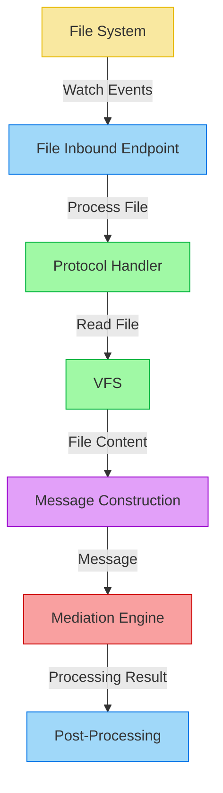

# File Inbound Endpoint

This document details the implementation of the file inbound endpoint in Synapse Go, including the architecture, configuration, and operation flow.

## Architecture Overview

The file inbound endpoint in Synapse Go implements the `InboundEndpoint` interface and provides a framework for watching and processing files from various file systems.



## Key Components

### File Inbound Adapter

The File Inbound adapter implements the `InboundEndpoint` port from the domain core:

```go
type FileInbound struct {
    config      domain.InboundConfig
    vfs         vfs.FileSystem
    syncMap     *sync.Map
    wg          *sync.WaitGroup
    ctx         context.Context
    cancelFunc  context.CancelFunc
    logger      *slog.Logger
    level       slog.Level
    pollMs      int
    watchDir    string
    doneDir     string
    failedDir   string
    filePattern string
}
```

This adapter:
- Monitors a directory for new files matching a pattern
- Processes each file through a mediation sequence
- Moves processed files to success/failure directories
- Handles concurrency and graceful shutdown

### Virtual File System

The Virtual File System (VFS) abstraction allows the inbound endpoint to work with different file systems:

```go
type FileSystem interface {
    ReadDir(path string) ([]os.FileInfo, error)
    Open(path string) (vfs.File, error)
    Rename(oldpath, newpath string) error
    Stat(path string) (os.FileInfo, error)
    // ...other methods
}
```

With implementations for:
- Local filesystem
- FTP 
- SFTP

### Factory Pattern

The File Inbound endpoint uses a factory pattern to create the appropriate inbound endpoint based on configuration:

```go
func NewInbound(config domain.InboundConfig) (ports.InboundEndpoint, error) {
    // Check the protocol and create the appropriate inbound endpoint
    switch config.Protocol {
    case "file":
        return file.NewFileInbound(config)
    case "ftp":
        return file.NewFTPInbound(config)
    case "sftp":
        return file.NewSFTPInbound(config)
    default:
        return nil, fmt.Errorf("unsupported protocol: %s", config.Protocol)
    }
}
```

This allows the client code to create the appropriate inbound endpoint without knowing the details of the implementation.

## Concurrency Control

### File Processing with sync.Map

To avoid processing the same file multiple times, the inbound endpoint uses a `sync.Map` to track files that are currently being processed:

```go
// Check if the file is already being processed
_, loaded := f.syncMap.LoadOrStore(file.Name(), true)
if loaded {
    // File is already being processed, skip it
    continue
}

// Process the file asynchronously
f.wg.Add(1)
go func(filePath string, fileName string) {
    defer f.wg.Done()
    defer f.syncMap.Delete(fileName) // Remove from the map when done
    
    // Process the file
    // ...
}(filePath, file.Name())
```

This approach:
1. Uses `LoadOrStore` for atomic check-and-set operations
2. Ensures files are not processed multiple times
3. Leverages goroutines for concurrent processing
4. Removes entries from the map when processing completes

### Graceful Shutdown

The file inbound endpoint implements graceful shutdown to ensure that in-flight operations can complete before the process exits:

```go
func (f *FileInbound) Start(ctx context.Context, mediator ports.InboundMessageMediator) error {
    f.ctx, f.cancelFunc = context.WithCancel(ctx)
    
    // Start processing files
    go f.processFiles(mediator)
    
    // Monitor for context cancellation
    go func() {
        <-f.ctx.Done()
        f.logger.Info("File inbound shutting down")
        f.wg.Wait() // Wait for all processing to complete
        f.logger.Info("File inbound shutdown complete")
    }()
    
    return nil
}

func (f *FileInbound) Stop() error {
    if f.cancelFunc != nil {
        f.cancelFunc()
    }
    return nil
}
```

This implementation:
1. Creates a cancellable context from the parent context
2. Monitors for context cancellation in a separate goroutine
3. Waits for all processing to complete before signaling shutdown completion
4. Provides a clean `Stop` method for explicit shutdown

## File Processing Flow

The file processing flow follows these steps:

1. **Polling**: The directory is polled at configured intervals
2. **Pattern Matching**: Files matching the configured pattern are identified
3. **Duplicate Check**: `sync.Map` ensures each file is processed only once
4. **Async Processing**: Each file is processed in a separate goroutine
5. **Mediation**: The file is passed to the mediation engine
6. **Outcome Handling**: Based on the processing result, the file is moved to success or failure directory

```go
func (f *FileInbound) processFiles(mediator ports.InboundMessageMediator) {
    ticker := time.NewTicker(time.Duration(f.pollMs) * time.Millisecond)
    defer ticker.Stop()
    
    for {
        select {
        case <-f.ctx.Done():
            return
        case <-ticker.C:
            // Read directory and process files
            files, err := f.vfs.ReadDir(f.watchDir)
            if (err != nil) {
                f.logger.Error("Error reading directory", "dir", f.watchDir, "error", err)
                continue
            }
            
            for _, file := range files {
                // Skip directories
                if file.IsDir() {
                    continue
                }
                
                // Check if the file matches the pattern
                if f.filePattern != "" && !f.matchPattern(file.Name()) {
                    continue
                }
                
                filePath := path.Join(f.watchDir, file.Name())
                
                // Check if the file is already being processed
                _, loaded := f.syncMap.LoadOrStore(file.Name(), true)
                if loaded {
                    continue
                }
                
                // Process the file asynchronously
                f.wg.Add(1)
                go f.processFile(filePath, file.Name(), mediator)
            }
        }
    }
}
```

## Multiple Backend Support

The file inbound endpoint supports multiple file system backends through protocol-specific handlers:

### FTP Handler

```go
type FTPProtocolHandler struct {
    conn *ftp.ServerConn
    // ...other fields
}

func NewFTPProtocolHandler(params map[string]string) (*FTPProtocolHandler, error) {
    // Connect to FTP server
    conn, err := ftp.Dial(fmt.Sprintf("%s:%s", params["host"], params["port"]), ftp.DialWithTimeout(timeout))
    if err != nil {
        return nil, err
    }
    
    // Login
    err = conn.Login(params["username"], params["password"])
    if err != nil {
        return nil, err
    }
    
    return &FTPProtocolHandler{
        conn: conn,
        // ...initialize other fields
    }, nil
}
```

### SFTP Handler

```go
type SFTPProtocolHandler struct {
    client *sftp.Client
    // ...other fields
}

func NewSFTPProtocolHandler(params map[string]string) (*SFTPProtocolHandler, error) {
    // Create SSH client
    config := &ssh.ClientConfig{
        User: params["username"],
        Auth: []ssh.AuthMethod{
            ssh.Password(params["password"]),
        },
        HostKeyCallback: ssh.InsecureIgnoreHostKey(),
    }
    
    conn, err := ssh.Dial("tcp", fmt.Sprintf("%s:%s", params["host"], params["port"]), config)
    if err != nil {
        return nil, err
    }
    
    // Create SFTP client
    client, err := sftp.NewClient(conn)
    if err != nil {
        return nil, err
    }
    
    return &SFTPProtocolHandler{
        client: client,
        // ...initialize other fields
    }, nil
}
```

## Context Usage

The file inbound endpoint makes extensive use of Go's context package for several purposes:

1. **Cancellation Propagation**: The parent context allows shutdown signals to propagate
2. **Derived Contexts**: Child contexts are created for file processing operations
3. **Timeouts**: Context timeouts are used for operations that should not block indefinitely
4. **Value Storage**: Context values store processing metadata

```go
// Create context with timeout for file processing
ctx, cancel := context.WithTimeout(f.ctx, 30*time.Second)
defer cancel()

// Add file information to context
ctx = context.WithValue(ctx, "filename", fileName)
ctx = context.WithValue(ctx, "filepath", filePath)

// Process file with timeout-aware context
result, err := mediator.Mediate(ctx, message)
```

## Summary

The File Inbound endpoint in Synapse Go demonstrates several advanced patterns and features:

1. **Hexagonal Architecture**: Implementation of the `InboundEndpoint` port from the domain core
2. **Factory Pattern**: Dynamic creation of appropriate handlers based on configuration
3. **Virtual File System**: Abstraction that enables multiple backend support
4. **Concurrency Control**: Use of `sync.Map`, goroutines, and wait groups
5. **Graceful Shutdown**: Context cancellation and proper resource cleanup
6. **Protocol Handlers**: Adapters for different file systems (Local, FTP, SFTP)

This implementation provides a robust, configurable, and extensible mechanism for processing files from various sources while adhering to the architectural principles of the system.