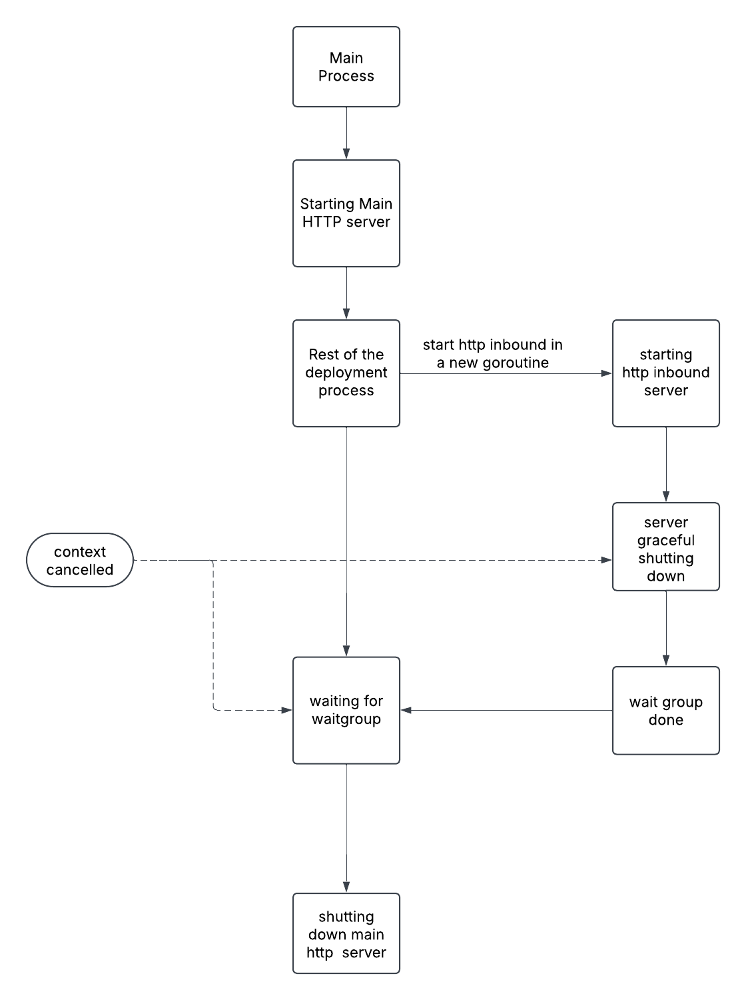

# HTTP Inbound Endpoint

This document details the implementation of the HTTP inbound endpoint in Synapse Go, including the architecture, configuration, and request flow.

## Architecture Overview

The HTTP inbound endpoint in Synapse Go implements the `InboundEndpoint` interface and handles incoming HTTP requests.


## HTTP Inbound Implementation

The HTTP Inbound adapter is implemented in `internal/app/adapters/inbound/http/http_inbound.go` and conforms to the `InboundEndpoint` port interface:

```go
type HTTPInbound struct {
    config     domain.InboundConfig
    ctx        context.Context
    cancelFunc context.CancelFunc
    server     *http.Server
    port       int
    logger     *slog.Logger
    level      slog.Level
}
```

### Initialization

The HTTP Inbound is initialized with configuration parameters:

```go
func NewHTTPInbound(config domain.InboundConfig) (*HTTPInbound, error) {
    // Extract port from parameters
    portStr, exists := config.Parameters["port"]
    if !exists {
        return nil, errors.New("port parameter is required for HTTP inbound")
    }
    
    port, err := strconv.Atoi(portStr)
    if err != nil {
        return nil, fmt.Errorf("invalid port: %s", portStr)
    }
    
    return &HTTPInbound{
        config: config,
        port:   port,
        logger: loggerfactory.GetLogger("http-inbound"),
    }, nil
}
```

The key parameters for an HTTP Inbound are:
- `port`: The TCP port on which the server will listen
- `sequence`: The name of the mediation sequence to execute for incoming requests

### Starting the Server

When the `Start` method is called, the HTTP Inbound creates a new HTTP server and starts listening for connections:

```go
func (h *HTTPInbound) Start(ctx context.Context, mediator ports.InboundMessageMediator) error {
    h.ctx, h.cancelFunc = context.WithCancel(ctx)
    
    // Create a new router
    router := mux.NewRouter()
    
    // Configure the handler
    router.HandleFunc("/{path:.*}", func(w http.ResponseWriter, r *http.Request) {
        h.handleRequest(w, r, mediator)
    })
    
    // Create the HTTP server
    h.server = &http.Server{
        Addr:    fmt.Sprintf(":%d", h.port),
        Handler: router,
    }
    
    // Start the server in a goroutine
    wg := ctx.Value(utils.WaitGroupKey).(*sync.WaitGroup)
    wg.Add(1)
    
    go func() {
        defer wg.Done()
        
        h.logger.Info("Starting HTTP inbound", "port", h.port, "sequence", h.config.SequenceName)
        if err := h.server.ListenAndServe(); err != nil && err != http.ErrServerClosed {
            h.logger.Error("HTTP inbound server error", "error", err)
        }
    }()
    
    // Monitor context for cancellation
    go func() {
        <-h.ctx.Done()
        h.logger.Info("Shutting down HTTP inbound", "port", h.port)
        
        // Create a timeout context for graceful shutdown
        shutdownCtx, cancel := context.WithTimeout(context.Background(), 10*time.Second)
        defer cancel()
        
        if err := h.server.Shutdown(shutdownCtx); err != nil {
            h.logger.Error("HTTP inbound shutdown error", "error", err)
        }
        
        h.logger.Info("HTTP inbound shutdown complete", "port", h.port)
    }()
    
    return nil
}
```

This implementation:
1. Creates a cancellable context from the parent context
2. Sets up a router that handles all paths
3. Configures the HTTP server with the router and port
4. Increments the wait group counter
5. Starts the server in a goroutine
6. Creates a second goroutine that monitors for context cancellation
7. Implements graceful shutdown when the context is cancelled

### Request Handling

Requests are handled by executing the configured mediation sequence:

```go
func (h *HTTPInbound) handleRequest(w http.ResponseWriter, r *http.Request, mediator ports.InboundMessageMediator) {
    // Create a new message from the request
    message := &domain.Message{
        Payload:     r,
        Destination: h.config.SequenceName,
    }
    
    // Get the sequence from the configuration context
    ctx := r.Context()
    configContext := ctx.Value(utils.ConfigContextKey).(*artifacts.ConfigContext)
    sequence := configContext.SequenceMap[h.config.SequenceName]
    
    // Execute the sequence
    result, err := sequence.Mediate(ctx, message, mediator)
    if err != nil {
        h.logger.Error("Error executing sequence", "sequence", h.config.SequenceName, "error", err)
        http.Error(w, "Internal Server Error", http.StatusInternalServerError)
        return
    }
    
    // Process the result
    if response, ok := result.Payload.(http.ResponseWriter); ok {
        // The sequence handled the response directly
        return
    }
    
    // Convert the result to a response
    h.writeResponse(w, result)
}
```

This method:
1. Creates a domain message from the HTTP request
2. Retrieves the configured sequence from the configuration context
3. Executes the sequence with the message
4. Handles errors by returning a 500 status code
5. Processes the result by writing it to the response

### Graceful Shutdown

The HTTP Inbound implements graceful shutdown to ensure that in-flight requests can complete before the server exits:

```go
func (h *HTTPInbound) Stop() error {
    if h.cancelFunc != nil {
        h.cancelFunc()
    }
    return nil
}
```

This method triggers the cancellation of the context, which initiates the graceful shutdown process.

## Port Offsets

To avoid port conflicts, Synapse Go supports port offsets that can be configured in the `deployment.toml` file:

```toml
[server]
hostname = "localhost"
offset = "100"
```

When an offset is configured, it affects all HTTP ports in the system:
- The main HTTP server port (default: 8290) becomes 8390
- HTTP inbound ports are also adjusted by adding the offset

The offset is applied during server initialization:

```go
func Run(ctx context.Context) error {
    // ...
    
    // Define default port
    httpServerPort := 8290
    var hostname string
    if serverConfig, ok := conCtx.DeploymentConfig["server"].(map[string]string); ok {
        hostname = serverConfig["hostname"]
        if offsetStr, offsetExists := serverConfig["offset"]; offsetExists {
            if offsetInt, err := strconv.Atoi(offsetStr); err == nil {
                httpServerPort += offsetInt
                log.Printf("Using port offset: %d, final port: %d", offsetInt, httpServerPort)
            } else {
                log.Printf("Warning: Invalid offset value '%s', using default port", offsetStr)
            }
        }
    }
    
    // ...
}
```

For HTTP inbound endpoints, the offset is applied when creating the inbound endpoint:

```go
func NewHTTPInbound(config domain.InboundConfig) (*HTTPInbound, error) {
    // ...
    
    // Apply port offset if configured
    if offsetStr, ok := config.Parameters["portOffset"]; ok {
        if offset, err := strconv.Atoi(offsetStr); err == nil {
            port += offset
        }
    }
    
    // ...
}
```

## Coordination with the Main HTTP Server

A key aspect of the HTTP Inbound implementation is its coordination with the main HTTP server during startup and shutdown. This coordination ensures that:

1. All servers start up in the correct order
2. In-flight requests can complete before shutdown
3. Resources are released in a coordinated manner

### Startup Coordination

During startup, the main HTTP server and HTTP inbound servers are started independently but tracked using the same wait group.

### Shutdown Coordination

During shutdown, the context cancellation signal propagates to all components, but the wait group ensures that the main process waits for all servers to complete their shutdown before exiting.



This coordination flow ensures that:
1. All components receive the shutdown signal simultaneously
2. Each component has time to complete in-flight operations
3. The main process waits until all components have shut down
4. Resources are released in a controlled manner

## Multiple HTTP Inbound Endpoints

Synapse Go supports deploying multiple HTTP inbound endpoints, each listening on a different port:

```xml
<inbound name="FirstHTTPInbound">
    <parameters>
        <parameter name="port">8080</parameter>
    </parameters>
    <sequence>TestInHTTPInbound</sequence>
    <protocol>http</protocol>
</inbound>

<inbound name="SecondHTTPInbound">
    <parameters>
        <parameter name="port">8081</parameter>
    </parameters>
    <sequence>AnotherSequence</sequence>
    <protocol>http</protocol>
</inbound>
```

Each HTTP inbound creates its own server instance and participates in the shared wait group for coordinated startup and shutdown.

## Summary

The HTTP Inbound implementation in Synapse Go provides:

1. **Dynamic HTTP Servers**: Creation of HTTP servers based on configuration
2. **Port Management**: Support for port offsets to avoid conflicts
3. **Graceful Shutdown**: Proper handling of in-flight requests during shutdown
4. **Context Propagation**: Use of context for cancellation and timeout management
5. **Coordination**: Integration with the application's overall lifecycle

This implementation ensures that HTTP inbound endpoints operate reliably, start and stop gracefully, and integrate seamlessly with the rest of the system while adhering to the hexagonal architecture principles.