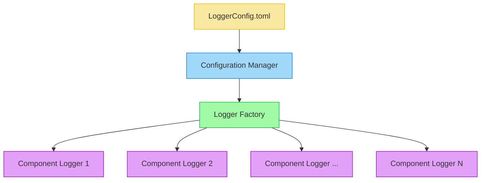

# Logging System

This document details the logging implementation in Synapse Go, including the architecture, configuration, and usage patterns.

## Architecture Overview

The logging system in Synapse Go uses a centralized logger factory that provides consistent logging throughout the application.



## Logger Factory

The core component of the logging system is the `LoggerFactory`, which serves as the Subject in the observer pattern:

```go
type LoggerManager struct {
    mu              sync.RWMutex
    logLevelMap     map[string]slog.Level
    slogHandlerOpts *slog.HandlerOptions
    loggers         map[string]*slog.Logger
    observers       []Observer
}
```

The `LoggerManager` maintains:
- A mapping of component names to log levels (`logLevelMap`)
- Configuration for the slog handler (`slogHandlerOpts`)
- A registry of created loggers (`loggers`)
- A list of observers that should be notified when log levels change

## Observer Pattern Implementation

The observer pattern allows components to register as observers and be notified when log levels change:

```go
type Observer interface {
    UpdateLogLevel(level slog.Level)
}

func (lm *LoggerManager) RegisterObserver(observer Observer, componentName string) {
    lm.mu.Lock()
    defer lm.mu.Unlock()
    
    lm.observers = append(lm.observers, observer)
    
    // Set the initial log level
    if level, exists := lm.logLevelMap[componentName]; exists {
        observer.UpdateLogLevel(level)
    } else if defaultLevel, exists := lm.logLevelMap["default"]; exists {
        observer.UpdateLogLevel(defaultLevel)
    }
}
```

When log levels are updated (typically through configuration changes), the `LoggerManager` notifies all observers:

```go
func (lm *LoggerManager) notifyObservers() {
    for _, observer := range lm.observers {
        componentName := observer.GetComponentName()
        if level, exists := lm.logLevelMap[componentName]; exists {
            observer.UpdateLogLevel(level)
        } else if defaultLevel, exists := lm.logLevelMap["default"]; exists {
            observer.UpdateLogLevel(defaultLevel)
        }
    }
}
```

## Component Logger Integration

Components in the application integrate with the logging system by:

1. Embedding a logger field
2. Implementing the `Observer` interface
3. Registering with the `LoggerManager`

```go
type SomeComponent struct {
    logger *slog.Logger
    level  slog.Level
}

func NewSomeComponent() *SomeComponent {
    sc := &SomeComponent{
        logger: loggerfactory.GetLogger("componentName"),
    }
    
    // Register as an observer
    loggerfactory.RegisterObserver(sc, "componentName")
    
    return sc
}

// Implement the Observer interface
func (sc *SomeComponent) UpdateLogLevel(level slog.Level) {
    sc.level = level
}

// Using the logger
func (sc *SomeComponent) DoSomething() {
    sc.logger.Info("Doing something")
}
```

## Dynamic Log Level Configuration

One of the key features of the logging system is the ability to change log levels at runtime without restarting the application. This is achieved through:

1. Configuration file watching
2. Updating the `LoggerManager` when configuration changes
3. Notifying observers of the changes

```go
func (lm *LoggerManager) SetLogLevelMap(levelMap *map[string]slog.Level) {
    lm.mu.Lock()
    defer lm.mu.Unlock()
    
    lm.logLevelMap = *levelMap
    
    // Update existing loggers
    for name, logger := range lm.loggers {
        if level, exists := lm.logLevelMap[name]; exists {
            // Update logger level
            // ...
        }
    }
    
    // Notify observers
    lm.notifyObservers()
}
```

## Integration with Configuration System

The logging system integrates with the configuration system to load and apply log level configurations:

```go
func InitializeConfig(ctx context.Context, confFolderPath string) error {
    // ...
    case strings.Contains(configFile.Name(), "Logger"):
        levelMap := make(map[string]slog.Level)
        slogHandlerConfig := &loggerfactory.SlogHandlerConfig{}
        
        if cfg.IsSet("levels") {
            var levelsMap map[string]string
            cfg.MustUnmarshal("levels", &levelsMap)
            
            for component, levelStr := range levelsMap {
                level := parseLogLevel(levelStr)
                levelMap[component] = level
            }
        }
        
        cm := loggerfactory.GetLoggerManager()
        cm.SetLogLevelMap(&levelMap)
        cm.SetSlogHandlerConfig(slogHandlerConfig)
        
        // Start watching for config changes
        cfg.Watch(context.Background(), configFilePath)
    // ...
}
```

When the configuration file is updated, the log levels are dynamically reconfigured without requiring an application restart.

## Structured Logging

The logging system uses structured logging through the `slog` package, which allows for:

1. Machine-parseable log output
2. Consistent log format
3. Context-rich logging with key-value pairs

```go
logger.Info("Processing request", 
    "method", request.Method, 
    "path", request.URL.Path, 
    "remote_addr", request.RemoteAddr)
```

## Advantages of the Observer Pattern

The observer pattern in the logging system provides several advantages:

1. **Decoupling**: The logging system is decoupled from the components that use it.
2. **Dynamic Configuration**: Log levels can be changed at runtime.
3. **Consistent Interface**: All components use the same logging interface.
4. **Centralized Control**: Log levels are managed in a single place.

## Summary

The Synapse Go logging system:

- Uses structured logging via the `slog` package
- Implements the observer pattern for dynamic log level configuration
- Integrates with the configuration system for runtime changes
- Provides component-specific log levels
- Maintains a clean interface for components to use

This design ensures that logging is flexible, consistent, and configurable throughout the application lifecycle, allowing for effective debugging and monitoring in both development and production environments.